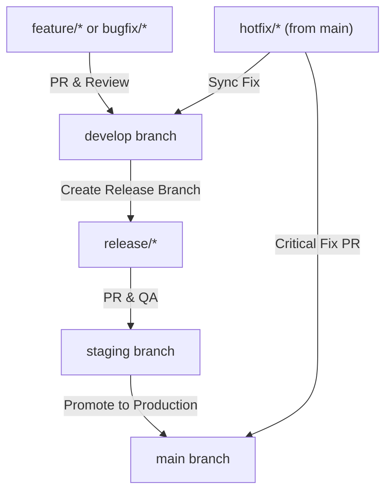

# Contributing Guidelines

Welcome! Thank you for contributing to the Aureon project. To maintain code quality, consistency, and stability across our environments, we follow a structured git branching model and strict development guidelines.

Please review these instructions before starting your work.

---

## 🌳 Core Long-Lived Branches

We maintain three primary long-lived branches, corresponding to different environments:

1. **`main` (Production)**
   * **Purpose:** Production-ready and active deployments.
   * **Rule:** Contains only stable, fully-tested release commits.
   * **Protection:** Direct pushes are disabled. Changes must go through a pull request from `staging` (or `hotfix/*` in critical cases) with mandatory CI/CD status checks and PR approval.

2. **`staging` (Pre-Release / QA)**
   * **Purpose:** QA, user acceptance testing (UAT), and demo deployments.
   * **Rule:** Mirrors production as closely as possible. Ensures that features are tested in a staging environment before being released to production.
   * **Protection:** Direct pushes are disabled. Updated via pull requests from `develop` or release branches.

3. **`develop` (Integration)**
   * **Purpose:** The main working/integration branch for active development.
   * **Rule:** New features and bugfixes are integrated here.
   * **Protection:** Require PR approval and passing test suites before merging.

---

## ⚡ Short-Lived Branches

All active work should be done on short-lived branches created off `develop` (or `main` for hotfixes). Use the following naming convention:

* **`feature/<name>`** (e.g., `feature/login-ui`)
  * Created from: `develop`
  * Merged into: `develop`
  * Purpose: New user stories, components, or functionality.

* **`bugfix/<name>`** (e.g., `bugfix/cart-calculation`)
  * Created from: `develop`
  * Merged into: `develop`
  * Purpose: Resolving bugs and non-critical issues found during development.

* **`hotfix/<name>`** (e.g., `hotfix/payment-gateway-timeout`)
  * Created from: `main`
  * Merged into: `main` and `develop`
  * Purpose: Urgent fixes for critical bugs found directly in the production environment.

* **`release/<version>`** (e.g., `release/v1.2.0`)
  * Created from: `develop`
  * Merged into: `staging` and `main`
  * Purpose: Preparing and stabilizing a new version release (bumping versions, final testing).

* **`docs/<topic>`** (e.g., `docs/contributing-update`)
  * Created from: `develop`
  * Merged into: `develop`
  * Purpose: Documentation updates, guidelines, and manuals.

---

## 🔁 Git Workflow Pipeline



### Steps to Propose Changes

1. **Synchronize your local environment:**
   ```bash
   git checkout develop
   git pull origin develop
   ```
2. **Create your workspace branch:**
   ```bash
   git checkout -b feature/your-feature-name
   ```
3. **Commit your changes:**
   * Write clean, descriptive commit messages.
   * Format: `type(scope): description` (e.g., `feat(ui): add 3D product card hover effects`).
4. **Open a Pull Request:**
   * Open your PR targeting the `develop` branch.
   * Ensure your code passes all lint and build checks (`npm run build`).

---

## Vercel Deployment Workflow

### Production Deployment

Production deployments are built from the `main` branch.

Required Vercel project settings:

* **Production Branch:** `main`
* **Install Command:** use Vercel default `npm install`
* **Build Command:** `npm run build`
* **Output Directory:** `dist`

Required production environment variables:

```env
DATABASE_URL=your_neon_production_pooled_connection_string
DIRECT_URL=your_neon_production_direct_connection_string
JWT_SECRET=your_production_jwt_secret
```

### Staging Deployment

Staging deployments should be created from the `staging` branch as Vercel Preview Deployments, or from a separate Vercel project pinned to `staging`.

Recommended Vercel setup:

1. Keep the main Aureon Vercel project's **Production Branch** set to `main`.
2. Allow pushes to `staging` to create Preview Deployments.
3. Add the required variables for the **Preview** environment in Vercel:
   ```env
   DATABASE_URL=your_neon_staging_pooled_connection_string
   DIRECT_URL=your_neon_staging_direct_connection_string
   JWT_SECRET=your_staging_jwt_secret
   ```
4. Use a separate Neon database or Neon branch for staging so QA does not write to production data.
5. Trigger staging by merging or pushing verified code to `staging`.

Local validation before promoting staging:

```bash
npm run typecheck
npm run build
```

Promotion path:

```text
develop -> staging -> main
```

---

## 🔒 Repository Rules & Best Practices

To enforce code quality, our GitHub configuration mandates the following rules:

* **Branch Protection Rules:** Direct pushes to `main`, `staging`, and `develop` are strictly prohibited.
* **PR Review Requirements:**
  * Pull requests to **`main`** require at least **2 approvals** from core maintainers.
  * Pull requests to **`staging`** and **`develop`** require at least **1 approval**.
* **CI/CD Status Checks:** All continuous integration pipelines, tests, and build checks must pass before a branch can be merged.
* **Clean History:** Standardize on "Squash and Merge" or "Rebase and Merge" when merging feature branches to keep the git history clean and readable.
